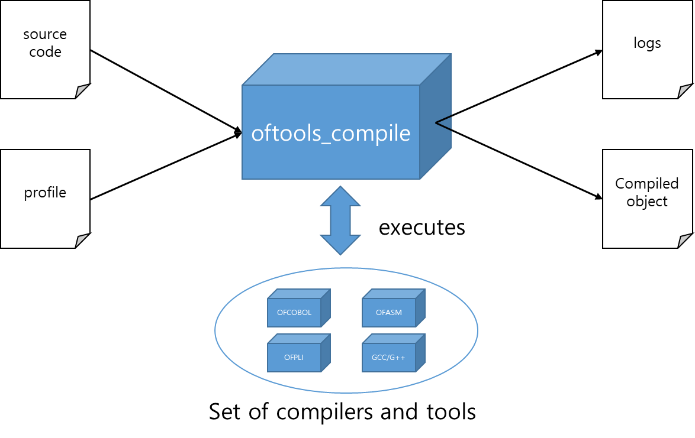
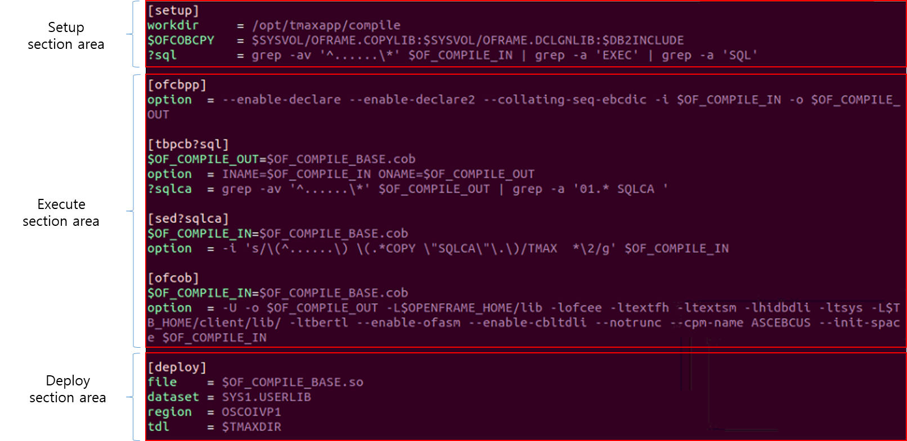
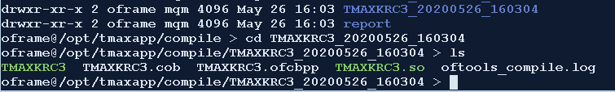
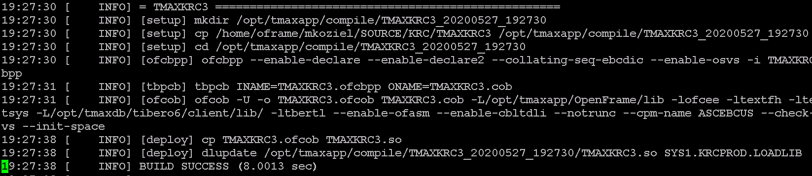
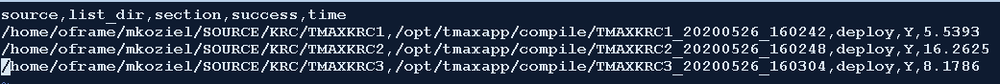

# oftools_compile User Guide <!-- omit in toc -->

## Table of Contents <!-- omit in toc -->

- [1. Overview](#1-overview)
- [2. Usage](#2-usage)
- [3. Profile](#3-profile)
  - [3.1 Setup section area](#31-setup-section-area)
  - [3.2 Execute section area](#32-execute-section-area)
  - [3.3 Deploy section area](#33-deploy-section-area)
  - [3.4 Environment variable](#34-environment-variable)
  - [3.5 Filter variable](#35-filter-variable)
- [4. Outputs](#4-outputs)
  - [4.1 Work Directory](#41-work-directory)
  - [4.2 Log File](#42-log-file)
  - [4.3 Report File](#43-report-file)
- [Appendix A. Profile Examples](#appendix-a-profile-examples)
  - [A.1 COBOL](#a1-cobol)

## 1. Overview

OpenFrame Tools Compile or oftools_compile is a general purpose build tool that is designed to be flexible to support compilers and tools available in the OpenFrame environment.  
The diagram below shows an overview of the oftools_compile tool.  



## 2. Usage

```
oftools_compile -p <path_to_profile> -s <path_to_source> [options]
```

```
optional arguments:
  -h,         --help                show this help message and exit
  -p PROFILE, --profile PROFILE     profile which contains description of the compilation target.
  -s SOURCE,  --source SOURCE       name of the source which must be a file. (Or a directory if using the -r option)
  -r,         --recursive           activate recursive compilation (used when passing a directory)
  -e,         --export              generate the csv formatted report file.
  -l LOG,     --log LOG             set log level (DEBUG|INFO|WARNING|ERROR|CRITICAL)
                                        DEBUG    - Show developer debug messages and higher
                                        INFO     - Show only information and higher
                                        WARNING  - Show only warnings or higher
                                        ERROR    - Show only Errors or higher
                                        CRITICAL - Show only critical errors
```

## 3. Profile

The profile is a manifest on how the build process should be executed. It consists of three different types of section areas which are: setup section area, execute section area, and deploy section area.  
Each section area consists of one or more sections and each section requires dedicated options to be defined.  Note that a section can be defined by a string surrounded by \[ \] and does not allow duplicated names.  
The environment variables and the filter variables are allowed to be defined in any of sections in the profile. Also note that a filter variable will be executed at the time it is defined, meaning if you want to filter one of temporary files generated by a section, it needs to come after the execution of said section.



### 3.1 Setup section area

The setup section area only allows to define one ```[setup]``` section.  In the ```[setup]``` section, the 'workdir' option must be defined.  
The 'workdir' option is a fully qualified path to the working directory which oftools_compile uses during the entire build process.  

### 3.2 Execute section area

The execute section area is for the sections that executes compilers and tools to build a program.  
Unlike setup section area, this section area allows you to define multiple sections.  
For each section, the name of the section is directly mapped to a Linux command and the value of the 'option' is appended to the command while the execution of the Linux command.  
For instance, if you define a section as ```[ofcbpp]```, with 'option' defined as "-i $OF_COMPILE_IN -o $OF_COMPILE_OUT", then the Linux command ```ofcbpp -i $OF_COMPILE_IN $OF_COMPILE_OUT``` will be executed.
Filter variables added after the options in this section area will be executed before the next section. For example, let's say you have 3 sections: ofcbpp, tbpcb, and ofcob. If we want a filter variable executed before ofcob, we need to define it at the end of the tbpcb section. An example of this can be found in Appendix A. for the sqlca filter variable.

### 3.3 Deploy section area

The deploy section area is for defining how the compiled program gets deployed into different destinations.  
This section area only allows you to define ```[deploy]``` section only, but you can still append filter variables to the section name if needed.  
In deploy section, there are four different type of options that you can define.

1. file
    - Specify the file name that needs to be deployed.
    - Internally, the $OF_COMPILE_IN will be copied into the file name specified.
2. dataset
    - Name of the target dataset that the file needs to be deployed to.
    - Internally, it will trigger 'dlupdate' command to deploy the file to the dataset.
3. tdl
    - Name of the tdl library path which the file needs to be deployed to.
    - Internally, it will trigger 'tdlupdate' command to deploy the file to the tdl library.
4. region
    - Name of the osc region name which the file needs to be deployed to.
    - Internally, it will trigger 'osctdlupdate' command to deploy the file to the osc tdl library.
  
### 3.4 Environment variable

The environment variable can be defined by adding '$' as a prefix to the name of an option.
This environment variable is equivalent to the environment variable that is being used in the Linux system.  
There are pre-defined environment variables that oftools_compile uses which are ```$OF_COMPILE_IN```, ```$OF_COMPILE_OUT```, and ```$OF_COMPILE_BASE```.

1. $OF_COMPILE_IN
    - Holds the input file name of the given section.
    - This value gets automatically updated by previous section's ```$OF_COMPILE_OUT``` value at the time when given section gets initialized.
    - This can be overridden by defining ```$OF_COMPILE_IN``` in the given section.
2. $OF_COMPILE_OUT
    - Holds the output file name of the given section.
    - This value gets automatically updated by replacing extension of ```$OF_COMPILE_IN``` to current sections name at the time when given section gets initialized.
    - This can be overridden by defining ```$OF_COMPILE_IN``` in the given section.
3. $OF_COMPILE_BASE
    - Holds the $OF_COMPILE_IN value without extension.
    - This value gets automatically updated by removing extension of ```$OF_COMPILE_IN``` at the time when given section gets initialized.
    - This can be overridden by defining ```$OF_COMPILE_BASE``` in the given section.

### 3.5 Filter variable

The filter variable can be defined by adding '?' as a prefix to the name of an option.
The main purpose of this variable is to execute sections conditionally based on the result of the filter variable.
For example, when you append a filter variable to a section name, the given section will be executed only if the filter variable is true or has a return code of zero.
Note that when you define multiple sections with the same name but have different filter variables appended, only one of them will be executed during the build process.  
For instance, if there are sections defined ```[ofcob?sql]```, ```[ofcob?rw]```, ```[ofcob]``` and only ?rw filter variable is true, then the section ```[ofcob?rw]``` will be executed while [ofcob?sql] and [ofcob] will be ignored.  

## 4. Outputs

### 4.1 Work Directory

The workdir option is set to a working directory where the log, report, and intermediate files gets stored.  
There is two different types of directory inside the workdir.

1. report
    - The report file formatted as csv is located in this folder.
    - Each report file has a time stamp in the file name to tell us when the file got created. 
2. file name with the time stamp
    - For each compiling source, a dedicated folder is created as ```PROGRAMNAME_YYYYMMDD_HHMMSS```.
    - In this folder, you can see the oftools_compile.log file that describes what sections and commands were executed.
    - Also, you may see intermediate files here if they got generated during the execution of sections.

Here is an example of what the working directory, created for the compilation of the TMAXKRC3 program, would look like.



### 4.2 Log File

The log file stores information about what commands were executed. Here's a snippet of what it would look like.



In the log file, you will see a string with a section appended to the actual command that has been executed.
For instance, in the tbpcb section, you can see the actual command that has been executed for tbpcb.

```
[tbpcb] tbpcb INAME=TMAXKRC3.ofcbpp ONAME=TMAXKRC3.cob
```

### 4.3 Report File

The Report file is formatted as csv or a comma delimitted file that displays: The name of the source code (fully qualified path), The directory for the listing files, the last section executed, whether the last section executed was successful or not, and the amount of time it took to complete compilation.
By utilizing this file, you will be able to understand what program has failed and in which step it failed.

Here's an example:



You can see based on the example that 3 programs were compiled. TMAXKRC1, TMAXKRC2, and TMAXKRC3. All 3 were successful because they all reached the deploy stage which is the last stage of our profile, and they all executed deploy successfully.

## Appendix A. Profile Examples

### A.1 COBOL

This section shows an example for a profile that can be used to build a COBOL program.

```
[setup]
workdir     = /opt/tmaxapp/compile
# declare environment variables
$SYSVOL     = /opt/tmaxapp/OpenFrame/volume/SYSVOL
$DB2INCLUDE = $SYSVOL/DB2.INCLUDE:$SYSVOL/DB2.INCLUDE2
$OFCOBCPY   = $SYSVOL/OFRAME.COPYLIB:$SYSVOL/OFRAME.DCLGNLIB:$DB2INCLUDE
# declare filter variables
?sql        = grep -av '^......\*' $OF_COMPILE_IN | grep -a 'EXEC' | grep -a 'SQL'
?rw         = grep -av '^......\*' $OF_COMPILE_IN | grep -a 'REPORT' | grep -a 'SECTION' | grep -av '-'
?online     = grep -av '^......\*' $OF_COMPILE_IN | grep -a 'EXEC' | grep -a 'CICS'

[ofcbpp?rw]
option  = --enable-declare --enable-declare2 --collating-seq-ebcdic --enable-rw -i $OF_COMPILE_IN -o $OF_COMPILE_OUT

[ofcbpp]
option  = --enable-declare --enable-declare2 --collating-seq-ebcdic -i $OF_COMPILE_IN -o $OF_COMPILE_OUT

[tbpcb]
$OF_COMPILE_OUT=$OF_COMPILE_BASE.cob
option  = INAME=$OF_COMPILE_IN ONAME=$OF_COMPILE_OUT
?sqlca  = grep -av '^......\*' $OF_COMPILE_OUT | grep -a '01.* SQLCA '

[sed?sqlca]
$OF_COMPILE_IN=$OF_COMPILE_BASE.cob
option  = -i 's/\(^......\) \(.*COPY \"SQLCA\"\.\)/TMAX  *\2/g' $OF_COMPILE_IN

[ofcob?rw]
$OF_COMPILE_IN=$OF_COMPILE_BASE.cob
option  = -U -o $OF_COMPILE_OUT -L$OPENFRAME_HOME/lib -lofcee -ltextfh -ltextsm -lhidbdli -ltsys -L$TB_HOME/client/lib/ -ltbertl --enable-ofasm --enable-rw --enable-cbltdli --notrunc --cpm-name ASCEBCUS --init-space $OF_COMPILE_IN

[ofcob]
$OF_COMPILE_IN=$OF_COMPILE_BASE.cob
option  = -U -o $OF_COMPILE_OUT -L$OPENFRAME_HOME/lib -lofcee -ltextfh -ltextsm -lhidbdli -ltsys -L$TB_HOME/client/lib/ -ltbertl --enable-ofasm --enable-cbltdli --notrunc --cpm-name ASCEBCUS --init-space $OF_COMPILE_IN

[deploy]
file    = $OF_COMPILE_BASE.so
dataset = SYS1.USERLIB
```

The first section we have listed is the ```[setup]``` section. In the ```[setup]``` section we first define the 'workdir' option which is the path to the working directory.  
Next, environment variables for the script are declared and denoted with a ```$```. This way, ```$SYSVOL``` can be referenced again in the ```$DB2INCLUDE``` variable as well as the ```$OFCOBCPY``` variable.  
In addition, we apply some filter variables. These are grep commands that will be executed before a section is executed.
If the grep command receives a match, the return code will be set to 0 which will trigger the section.
In other words, for the ```[ofcbpp]``` section, if a match is found with 'REPORT' and 'SECTION', then we need to enable the report writer option ```(--enable-rw)``` which is why the ```[ofcbpp?rw]``` has the ```--enable-rw``` option while the normal ```[ofcbpp]``` section does not.
If there is no match, the default section will be executed without the filter variable. 

To set the explicit name of the files, the variables ```$OF_COMPILE_IN``` and ```$OF_COMPILE_BASE``` is defined in the sections. If you do not define those environment variables, those will be implicitly defined as described in 3.4 Environment variable.