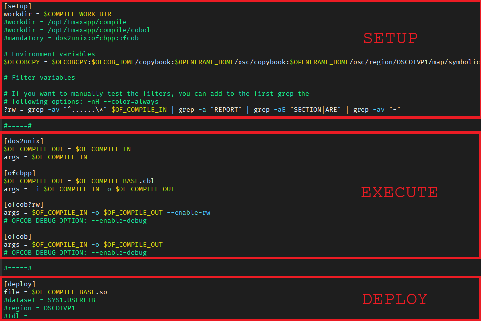
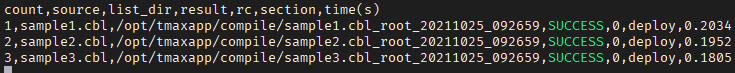

# OpenFrame Tools Compile - User Guide <!-- omit in toc -->

## Table of Contents <!-- omit in toc -->

* [1. Overview](#1-overview)
* [2. Usage](#2-usage)
* [3. Profile](#3-profile)
  * [3.1 Setup Division](#31-setup-division)
  * [3.2 Execute Division](#32-execute-division)
  * [3.3 Deploy Division](#33-deploy-division)
  * [3.4 Environment variable](#34-environment-variable)
  * [3.5 Filter function](#35-filter-function)
* [4. Outputs](#4-outputs)
  * [4.1 Work Directory](#41-work-directory)
  * [4.2 Log File](#42-log-file)
  * [4.3 Grouping Option](#43-grouping-option)
  * [4.4 Report File](#44-report-file)

<div style="page-break-after: always;"></div>

## 1. Overview

**OpenFrame Tools Compile** or **oftools_compile** is a general purpose build tool that is designed to be flexible to support compilers and tools available in the OpenFrame environment. The diagram below shows an overview of the **oftools_compile** tool.


## 2. Usage

```bash
oftools_compile -p <path_to_profile> -s <path_to_source> [options]
```

```bash
usage: oftools_compile -p PROFILE -s SOURCE [-c] [-g] [-l LEVEL] [--skip]
                       [-t TAG] [-h] [-v]

OpenFrame Tools Compile

Required arguments:
  -p PROFILE, --profile PROFILE
                        name of the profile, contains the description of the
                        compilation target
  -s SOURCE, --source SOURCE
                        name of the source, either a file or a directory

Optional arguments:
  -c, --clear           clear all the files generated during compilation
  -g, --grouping        put all the compilation folders in a single one for
                        mass compilation and aggregate all the logs
  -l LEVEL, --log-level LEVEL
                        set log level, potential values: DEBUG, INFO, WARNING,
                        ERROR, CRITICAL. (default: INFO)
  --skip                set skip flag, used to skip source files if not found
  -t TAG, --tag TAG     add a tag to the name of the report file and the
                        listing directory

Help & version:
  -h, --help            show this help message and exit
  -v, --version         show this version message and exit
```

<div style="page-break-after: always;"></div>

## 3. Profile

The profile is a configuration file that describe how the build process should be executed. It consists of three different types of divisions which are: **setup** division, **execute** division, and **deploy** division. Each division consists of one or more sections and each section requires dedicated options to be defined. Note that a section can be defined by a string surrounded by \[ \] and does not allow duplicated names.



The environment and the filter functions are allowed to be defined in any of the sections of the profile. Note that a filter function will be saved in the program memory when defined, and executed only when needed, which means when used in a given section.

### 3.1 Setup Division

The **setup** division allows to define one `[setup]` section only. In the `[setup]` section, here are the available options:

- 'workdir' option is required. This option is the absolute path to the working directory which oftools_compile uses during the entire build process and where the files resulting of the compilation go. It can be defined using environment variables.
  
- 'mandatory' option is optional. This option is the list of section that must be run at some point through the program execution, colon separated.
  
- as any other section, the `[setup]` section accepts environment and filter functions definitions.


### 3.2 Execute Division

The **execute** division is for the sections that execute compilers and tools to build a program. Unlike the setup division, this section area allows you to define multiple sections. For each section, the name of the section is directly mapped to a Linux command and the value of the 'args' option is appended to the command while the execution of the Linux command. This is possible to use filter functions with the section names' of this division.

For any section of the **execute** division, here are the available options:

- 'args': for instance, if you define a section as `[ofcbpp]`, with 'args' defined as `-i $OF_COMPILE_IN -o $OF_COMPILE_OUT`, then the Linux command `ofcbpp -i $OF_COMPILE_IN -o $OF_COMPILE_OUT` will be executed.

- as any other section, a section of the **execute** division accepts environment and filter functions definitions.


### 3.3 Deploy Division

The **deploy** division is for defining how the compiled program gets deployed into different destinations. This division allows to define multiple `[deploy]` sections. This is possible to use filter functions with the section names' of this division.

In a `[deploy]` section, there are four different types of options that you can define:

1. **file**
    - Name of the file that needs to be deployed.
    - Required: yes
    - Internally, the `$OF_COMPILE_IN` of the `[deploy]` section will be copied into the file name specified.
2. **dataset**
    - Name of the target dataset that the file needs to be deployed to.
    - Required: no
    - Internally, it will trigger `dlupdate` command to deploy the file to the dataset.
3. **region**
    - Name of the osc region name which the file needs to be deployed to.
    - Required: no
    - Internally, it will trigger `osctdlupdate` command to deploy the file to the osc tdl library.
4. **tdl**
    - Name of the tdl library path which the file needs to be deployed to.
    - Required: no
    - Internally, it will trigger `tdlupdate` command to deploy the file to the tdl library.

- as any other section, a section of the **deploy** division accepts environment and filter functions definitions.


### 3.4 Environment variable

An environment variable can be defined by adding `$` as a prefix to the name of an option. This environment variable is equivalent to an environment variable that is being used in the Linux system. There are pre-defined environment variables that oftools_compile uses which are `$OF_COMPILE_IN`, `$OF_COMPILE_OUT`, and `$OF_COMPILE_BASE`.

1. **$OF_COMPILE_IN**
    - Holds the input file name of the given section.
    - This value gets automatically updated by previous section's `$OF_COMPILE_OUT` value at the time the given section gets initialized.
    - This can be overridden by defining `$OF_COMPILE_IN` in the given section.
2. **$OF_COMPILE_OUT**
    - Holds the output file name of the given section.
    - This value gets automatically updated by replacing the extension of `$OF_COMPILE_IN` to current section name (without filters if any) at the time the given section gets initialized.
    - This can be overridden by defining `$OF_COMPILE_OUT` in the given section.
3. **$OF_COMPILE_BASE**
    - Holds the `$OF_COMPILE_IN` value without extension.
    - This value gets automatically updated by removing extension of `$OF_COMPILE_IN` at the time the given section gets initialized.
    - This can be overridden by defining `$OF_COMPILE_BASE` in the given section.

### 3.5 Filter function

A filter function can be defined by adding '?' as a prefix to the name of an option. The main purpose of this function is to execute sections conditionally based on the result of it. For example, when you append a filter function to a section name, the given section will be executed only if the filter function is true or has a return code of zero.

Note that when you define multiple sections with the same name but have different filter functions appended, only one of them will be executed during the build process.

For instance if there are three sections defined, `[ofcbpp?sql]`, `[ofcbpp?cics]`, `[ofcbpp]`, and only the filter function **?sql** is true, then the section `[ofcbpp?sql]` will be executed while `[ofcbpp?cics]` and `[ofcbpp]` will be ignored. Moreover, the sections using a filter function must be placed before the default section without filter. Using the example seen previously, `[ofcbpp?sql]` and `[ofcbpp?cics]` sections must be placed before the `[ofcbpp]` section. If the `[ofcbpp]` section was first, oftools_compile would executes the section `[ofcbpp]` directly, and consequently it would not even consider the sections with a filter, `[ofcbpp?sql]` and `[ofcbpp?cics]`.

Moreover, if the next section `[ofcob]` also needs a filter function to be evaluated, let's say there are 2 sections `[ofcob?rw]` and `[ofcob]` , it may be necessary to define the filter function **?rw** in each of the previous `[ofcbpp]` sections. Since we don't know in advance which `[ofcbpp]` section is going to be executed for a given program, we need to make sure that the filter **?rw** is properly defined. A good practice is to place all the filter function definitions in the setup division, since we know in advance that this section division will be executed unconditionally.

Profile example:


<div style="page-break-after: always;"></div>

## 4. Outputs

### 4.1 Work Directory

The 'workdir' option is set to a working directory where the log, report, and intermediate files of the compilation get stored. There are two different types of directory inside the workdir.

1. **report**
    - The report file, formatted as a CSV, is located in this folder.
    - Each report file has a time stamp in the file name to tell us when the file got created.
2. **file name with a time stamp and a default tag**
    - For each compiling source, a dedicated folder is created as `PROGRAMNAME_<tag>_YYYYMMDD_HHMMSS`, where by default **tag** is the logname of the user running the `oftools_compile` command.
    - In this folder, you can see the _oftools_compile.log_ file that describes what sections and commands were executed.
    - Also, you may see intermediate files here if they got generated during the execution of the sections.

Here is an example of what the working directory, created for the compilation of the **sample.cob** program, would look like:


### 4.2 Log File

The log file stores information about which commands were executed. Here is a snippet of what it would look like:


In the log file, you will see a string with a section appended to the actual command that has been executed.
For instance, in the ofcbpp section, you can see the actual command that has been executed for ofcbpp.

```
[ofcbpp] ofcbpp -i sample.cob -i sample.cbl
```

It is possible to get more details about the execution of `oftools_compile` with the DEBUG log level:


### 4.3 Grouping Option

If the **grouping** option is used with the execution of oftools_compile (recommended when performing mass compilation), all the work directories created for each program are moved under a folder named as `group_<tag>_YYYYMMDD_HHMMSS`. Moreover, this option concatenates all _oftools_compile.log_ files in one _group.log_ for easy analysis if some errors occur during compilation.

See below example where the tag is the result of the `logname` command:


When you compile multiple programs at the same time using a directory as a source parameter, it is recommended to specify the language used in the **tag** option for tracking purposes. If all programs in your directory are COBOL programs, you should specify a tag like `COBOL_username` for instance.

### 4.4 Report File

The report file is formatted as a CSV, a comma delimited file, that displays:

-   the count of the programs
-   the name of the source code (absolute path),
-   the directory for the listing files,
-   whether the last section executed was successful or not,
-   the return code of the compilation,
-   the last section executed,
-   and the amount of time it took to complete compilation.

By utilizing this file, you will be able to understand which program has failed and in which exact step it failed.

Here's an example:



You can see based on the example that 3 programs were compiled, sample1, sample2, and sample3. All 3 were successful because they all reached the deploy stage which is the last stage of our profile, and they all executed deploy successfully.
