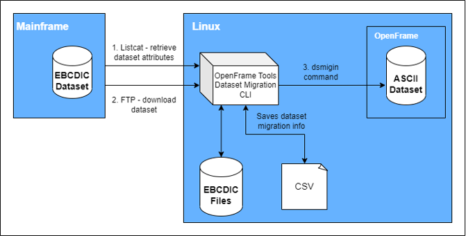

# OpenFrame Tools Dataset Migration - User Guide <!-- omit in toc -->

## Table of Contents <!-- omit in toc -->

* [1. Overview](#1-overview)
* [2. Usage](#2-usage)
* [3. CSV columns definition](#3-csv-columns-definition)
* [4. Outputs](#4-outputs)
  * [4.1 Initialization](#41-initialization)
  * [4.2 Working Directory](#42-working-directory)
  * [4.3 Log File](#43-log-file)
* [5. Jobs](#5-jobs)
  * [5.1 Number Option](#51-number-option)
  * [5.2 Listcat](#52-listcat)
    * [5.2.1 GDG datasets](#521-gdg-datasets)
    * [5.2.2 PO & PS datasets](#522-po--ps-datasets)
    * [5.2.3 VSAM datasets](#523-vsam-datasets)
    * [5.2.4 Datasets in Tape volume](#524-datasets-in-tape-volume)
  * [5.3 FTP](#53-ftp)
    * [5.3.1 PO datasets](#531-po-datasets)
    * [5.3.2 VSAM datasets](#532-vsam-datasets)
    * [5.3.3 Datasets in Tape volume](#533-datasets-in-tape-volume)
    * [5.3.4 Other type of datasets](#534-other-type-of-datasets)
  * [5.4 Migration](#54-migration)
  * [5.4.1 GDG datasets](#541-gdg-datasets)
  * [5.4.2 PO datasets](#542-po-datasets)
  * [5.4.3 PS datasets](#543-ps-datasets)
  * [5.4.4 VSAM datasets](#544-vsam-datasets)
* [6. Tag Option](#6-tag-option)

## 1. Overview

**OpenFrame Tools Dataset Migration** or **oftools_dsmigin** is a tool designed to manage the download and migration of datasets from a Mainframe environment to a Linux system with OpenFrame.



## 2. Usage

```bash
oftools_dsmigin -c <path_to_csv> -w <path_to_working_directory> [options]
```

```bash
usage: oftools_dsmigin -c CSV -w DIRECTORY [-L] [-F] [-M] [-C] [-e CODE]
                       [--enable_column COLUMN] [-g INTEGER] [-i IP_ADDRESS]
                       [--init] [--listcat-gen FILE] [-l LEVEL] [-n INTEGER]
                       [-p PREFIX] [-t TAG] [-h] [-v]

OpenFrame Tools Dataset Migration

Required arguments:
  -c CSV, --csv CSV     name of the CSV file, contains the datasets and their
                        parameters
  -w DIRECTORY, --working-directory DIRECTORY
                        path to the working directory

Jobs arguments:
  -L, --listcat         flag to trigger listcat execution, retrieve dataset
                        info from the Mainframe as well as VSAM dataset info
                        from a listcat file
  -F, --ftp             flag to trigger FTP execution, download datasets from
                        Mainframe
  -M, --migration       flag to trigger dsmigin, executes dataset conversion
                        and generation in the OpenFrame environment to start
                        dataset migration

Optional arguments:
  -C, --conversion      flag to modify the behavior of dsmigin, executes
                        conversion only
  -e CODE, --encoding_code CODE
                        encoding code for dataset migration, potential values:
                        US. (default: US)
  --enable_column COLUMN
                        list of CSV columns to enable instead of the default
                        value, separated with :. Supported columns: VOLSER,
                        CATALOG
  -g GENERATIONS, --generations GENERATIONS
                        number of generations to be processed, specifically
                        for GDG datasets
  -i IP_ADDRESS, --ip-address IP_ADDRESS
                        ip address required for any command that involves FTP
                        connection to Mainframe (listcat and ftp)
  --init                initializes the CSV file and the working directory
                        specified
  --listcat-gen FILE    appends datasets record from a text file to a CSV file
                        for listcat information
  -l LEVEL, --log-level LEVEL
                        log level, potential values: DEBUG, INFO, WARNING,
                        ERROR, CRITICAL. (default: INFO)
  -n NUMBER, --number NUMBER
                        number of datasets to be processed
  -p PREFIX, --prefix PREFIX
                        prefix used for VSAM datasets download
  -t TAG, --tag TAG     tag for the CSV backup and log file names

Help & version:
  -h, --help            show this help message and exit
  -v, --version         show the version message and exit
```

## 3. CSV columns definition

The CSV file is the key file for the execution of this tool. Indeed, it contains all the information about the datasets, the status of the download from the Mainframe environment to the Linux system, as well as the migration from the Linux system to the OpenFrame volume.

- **DSN**             = name of the dataset.
- **COPYBOOK**        = name of the copybook required for migration.
- **RECFM**           = record format (FB: Fixed Blocked | VB: Variable Blocked).
- **LRECL**           = logical record length.
- **BLKSIZE**         = block size.
- **DSORG**           = dataset organization (GDG | PO | PS | VSAM).
- **VOLSER**          = volume serial name.
- **VSAM**            = type of VSAM (ES: ESDS | KS: KSDS | RR: RRDS).
- **KEYOFF**          = key offset.
- **KEYLEN**          = key length.
- **MAXLRECL**        = max logical length.
- **AVGLRECL**        = average logical length.
- **CISIZE**          = cisize.
- **IGNORE**          = ignore or skip this row (Y: Yes | N: No ).
- **LISTCAT**         = listcat status (Y: Yes | N: No | F: Force).
- **LISTCATDATE**     = date stamp when the listcat has been executed.
- **FTP**             = download status (Y: Yes | N: No | F: Force).
- **FTPDATE**         = date stamp when the download has been executed.
- **FTPDURATION**     = duration of the download.
- **DSMIGIN**         = migration status (Y: Yes | N: No | F: Force).
- **DSMIGINDATE**     = date stamp when the migration has been executed.
- **DSMIGINDURATION** = duration of the migration.

> **Note**: By default, the columns VOLSER and CATALOG are disabled, which means that no matter what is the value of these columns the program will use DEFVOL as VOLSER parameter and SYS1.MASTER.ICFCAT as CATALOG parameter by default. It should be noted that these parameters are required for VSAM dataset migration only. To enable these columns, use the command line option `--enable-column` specifying which columns you want to enable. As a user you will be notified during the program execution (if the log level is set to DEBUG) which value is used for VOLSER and CATALOG.

## 4. Outputs

### 4.1 Initialization

Before starting to work with oftools_dsmigin, it is important to initialize the CSV file and the working directory. Since the two options `-c, --csv` and `-w, --working directory` are mandatory, here is an example command:

```bash
oftools_dsmigin --csv test.csv --working-directory ${HOME_DIRECTORY}/tmaxapp/migration/GDG --init
```

The recommended structure is to create one working directory per dataset type, here is an example:

screenshot of the folder structure of the working directory with one folder per type of dataset (GDG,PS,PO,VSAM)

### 4.2 Working Directory

By default, the working directory is *${HOME_DIRECTORY}/tmaxapp/migration*. This is the main working directory for dataset migration, because there are as many sub-folders as the type of datasets. Then, here is the structure of each subfolder:

screenshot of the content of the folder ${HOME_DIRECTORY}/tmaxapp/migration/GDG

In the working directory for GDG datasets, here is what you can find (the structure for other type of datasets is the same):

- */conversion*: directory where the program saves the migrated datasets when the command line option `-C,--conversion` is used. This option adds a `-C` to the `dsmigin` command arguments, which triggers dataset conversion only, and not the default dataset conversion and generation.
- */copybooks*: directory where the user copies manually the copybooks required for dataset migration.
- */csv_backups*: directory where the program saves a backup of the CSV file at each execution.
- */datasets*: directory where the program saves the datasets downloaded from the Mainframe.
- */listcat*: directory where the user can save a listcat text file, providing additional information for VSAM datasets. This is also in this folder that the program saves the **listcat.csv** file, output of the conversion from a TXT listcat file to a CSV, using the `--listcat-gen` command line option.
- */log*: directory where the program saves logs of the execution. Based on the value of the log level (customizable with the `-l, --log-level` command line option), it saves more or less event messages.
- *GDG.csv*: the CSV file with all the records for GDG datasets.

### 4.3 Log File

The log file stores information about which commands were executed. Here is a snippet of what it would look like:

screenshot of the log file with INFO level

In the log file, you will see event messages as well as commands the program is running: ftp, dsmigin and many other commands. 

## 5. Jobs

### 5.1 Number Option

**Command line option**: `-n, --number`

Before getting into the details of what oftools_dsmigin job details, we have to see what the number option is for. The user can specify this option in combination with any of the jobs listed below. Basically, it limits the number of datasets being processed by the current execution of the program.

This option is particularly useful to do some testing on a CSV file with thousand of datasets listed, but limiting the execution to only one (or just a few datasets) to check if everything works well. 

Moreover, this option is very useful in combination with the FTP job. In fact, the Mainframe FTP server has a timeout, which means dataset download can be interrupted. Knowing that generally datasets are very heavy files, downloading by chunks of datasets and not all of them at once could prevent from this scenario to happen. Consequently, it would avoid FTP interruption, data corruption, or any other type of issue related to the dataset download process.

### 5.2 Listcat

**Command line option**: `-l, --listcat`

The role of the listcat is to do a few things to retrieve as much information as possible on a given dataset, with some variations based on the dataset organization. 

Then, it uses several methods: connection to the Mainframe and execution of the `ls` command, conversion of a listcat file from TXT to CSV format, update on CSV records from a listcat CSV file (specifically for VSAM datasets). Here are the tasks executed regardless of the dataset organization:

- Analysis of the dataset record from the CSV file to assess dataset listcat eligibility
  - The listcat job will be executed if one of these conditions is met:
    - **LISTCAT** column is set to F (force the execution of the job regardless of the other columns of the record)
    - **LISTCAT** column is set to '' or Y
  - The listcat job will not be executed if one of these conditions is met:
    - **IGNORE** column is set to Y
    - **LISTCAT** column is set to N
  - If none of the conditions listed above is met, the listcat job will be executed
- Dataset info retrieval from the Mainframe if the user specified a correct IP address (using the command line option `-i, -ip-address`):
  - Execution of the ls command to retrieve as much information as possible on the given dataset
  - If the **VOLSER** of the dataset is set to *Migrated*, the program run the recall command (on the Mainframe it corresponds to the command `cd $DATASET_NAME`)
  - Other details for this method vary based on the dataset organization, so please find below longer description for each dataset type
- Dataset info retrieval from the file **listcat.csv**, for VSAM datasets specifically
- Writing down the status of the listcat execution and all the changes to the CSV file

#### 5.2.1 GDG datasets

For GDG datasets in the listcat job, there are some variations during the dataset info retrieval from the Mainframe.

Command line option interesting to use in combination with the listcat job for GDG datasets: `-g, --generations`. By default, the program only retrieve dataset information for the most recent generation, but with this option it is possible to retrieve dataset information for older generations of the given GDG.

The program handles GDG separately since it is very specific. First, the program run a `cd` command on the datasets, to then run a `ls` command and list all the generations available. Then, it can retrieve dataset information, only for the most recent or more if the user specified the `-g, --generations` command line option. Finally, it writes to the CSV all the dataset info retrieved.

It is capable to fill the following columns:
- **RECFM**
- **LRECL**
- **BLKSIZE**
- **DSORG**
- **VOLSER**

#### 5.2.2 PO & PS datasets

For both PO and PS datasets in the listcat job, this is very simple: the program only runs the `ls` command on the Mainframe to retrieve dataset information.

It is capable to fill the following columns:
- **RECFM**
- **LRECL**
- **BLKSIZE**
- **DSORG**
- **VOLSER**

#### 5.2.3 VSAM datasets

For VSAM datasets in the listcat job, there are some variations since this is the only type of dataset using the file **listcat.csv**. 

First, similarly to other type of datasets, it runs the `ls` command on the Mainframe, but then it also checks if the dataset is available in **listcat.csv**. If that is the case, it retrieves more information for the given VSAM dataset.

It is capable to fill the following columns using Mainframe info:
- **DSORG**

It is capable to fill the following columns using **listcat.csv**:
- **RECFM**
- **VSAM**
- **KEYOFF**
- **KEYLEN**
- **MAXLRECL**
- **AVGLRECL**
- **CISIZE**
- **CATALOG**

#### 5.2.4 Datasets in Tape volume

For datasets in Tape volume in the listcat job, this is very simple: it only runs the `ls` command and set the **VOLSER** column to **Tape**. 

More dataset information will be retrieved at the next step of the dataset migration, which is the download step.

### 5.3 FTP

**Command line option**: `-F, --ftp`

The role of the FTP is to download the given dataset, with some variations based on the dataset organization. 

Here are the tasks executed in this job:

- Analysis of the dataset record from the CSV file to assess dataset download eligibility
  - The FTP job will be executed if one of these conditions is met:
    - **FTP** column is set to F (force the execution of the job regardless of the other columns of the record)
    - **FTP** column is set to '' or Y
    - **VOLSER** column set to Tape
  - The FTP job will not be executed if one of these conditions is met:
    - **IGNORE** column is set to Y
    - **FTP** column is set to N
    - **LISTCATDATE** column not set (which means no successful listcat ran previously for the given dataset)
    - **VOLSER** column set to Pseudo
    - **VOLSER** column set to Migrated (which means the recall of the dataset during the listcat execution failed)
    - **DSORG** column set to VSAM and missing `-p, --prefix` command line option
    - **DSORG** column not set and **VOLSER** column not set to Tape
    - **DSORG** column set to invalid value 
- Dataset download from the Mainframe requires the user to specify a correct IP address (using the command line option `-i, -ip-address`):
  - Execution of the get command to download the given dataset
- Writing down the status of the FTP execution and all the changes to the CSV file

#### 5.3.1 PO datasets

For PO datasets, the program create a dedicated folder under the working directory: *$WORKING_DIRECTORY/datasets/PO_dataset_name*. And then, it downloads all the dataset members in this folder with the `get` command.

#### 5.3.2 VSAM datasets

Downloading a VSAM dataset from the Mainframe **without a pre-process** is **not possible**. First of all, it is necessary to **unload the VSAM dataset** on the Mainframe to a **flat file**. The naming convention for these files has to be the exact same dataset name with a given prefix in front of it. 

That is why the `-p, --prefix` command line option is **mandatory** to download a VSAM dataset. In the CSV file, the VSAM dataset should be specified without any prefix. Then, the program will download the equivalent flat file (named *prefix + VSAM_dataset_name*), and will save it in the Linux system named *VSAM_dataset_name* without prefix.

For instance, let's say there is a VSAM dataset OFTOOLS.VSAM.EXAMPLE. Here are the steps:

- Unloading dataset to flat file: OFTOOLS.VSAM.EXAMPLE -> UNLOAD.OFTOOLS.VSAM.EXAMPLE
- Download flat file from Mainframe to Linux server: UNLOAD.OFTOOLS.VSAM.EXAMPLE -> OFTOOLS.VSAM.EXAMPLE (even being renamed that is still **a flat file** and **not a VSAM dataset**).

Then, downloading the dataset is just an execution of the `get` command on the Mainframe.

#### 5.3.3 Datasets in Tape volume

As mentioned in the previous section, downloading a dataset from the Tape volume does not only download it but also retrieve information about it. It runs the `get` command on the dataset, which triggers download. And parsing the command output allows to retrieve dataset information.

It is capable to fill the following columns (only when **RECFM** = FB):
- **RECFM**
- **LRECL**

Even with these parameters being filled, this is not sufficient for a successful migration of the dataset. Which means that some manual effort will be required from the user to complete the other columns required for migration.

#### 5.3.4 Other type of datasets

For other type of datasets (GDG and PS datasets), the dataset download is just an execution of the `get` command on the Mainframe.

> **Note**: Please note that GDG is a type of dataset where most of the time the dataset organization is **PS**. So starting from the FTP execution, the dataset migration for GDG datasets is the same as the one for PS datasets since they share the same dataset organization.

### 5.4 Migration

**Command line option**: `-M, --migration`

The role of the migration is to migrate the given dataset, which means a conversion from EBCDIC to ASCII format and creation of a new entry in the OpenFrame volume, with some variations based on the dataset organization.

Here are the tasks executed in this job:

- Analysis of the dataset record from the CSV file to assess dataset migration eligibility
  - The migration job will be executed if one of these conditions is met:
    - **DSMIGIN** column is set to F (force the execution of the job regardless of the other columns of the record)
    - **DSMIGIN** column is set to '' or Y
  - The migration job will not be executed if one of these conditions is met:
    - **IGNORE** column is set to Y
    - **DSMIGIN** column is set to N
    - **FTPDATE** column not set (which means no successful FTP ran previously for the given dataset)
    - Other consideration based on the required columns for a successful migration, with some variations depending on the value of the **DSORG** column
    - **DSORG** column not set
    - **DSORG** column set to invalid value
- Execution of the command `cobgensch`, to generate the **schema** file from the **copybook**
- Dataset migration using the tool `dsmigin`
- Writing down the status of the migration execution and all the changes to the CSV file

The command line option `-e, --encoding-code` is optional since by default the program will use **US** as encoding code. The user can specify this command line option only to override the default value. Another optional command line option, `-C, --conversion`, can be used to use the conversion only mode of `dsmigin`.

### 5.4.1 GDG datasets

Here are the series of command to migrate a GDG (which has a PS organization) dataset:
- `dsdelete`: this command ensures that the given dataset does not already exist in the OpenFrame volume
- `dsmigin`: this command runs the migration, the conversion from EBCDIC to ASCII format and then the generation in OpenFrame, using all the parameters specified below

Required columns for successful migration:
- **DSN**
- **COPYBOOK**
- **RECFM**
- **LRECL**
- **BLKSIZE**
- **DSORG**

### 5.4.2 PO datasets

Here are the series of command to migrate a PO dataset:
- `dsdelete`: this command ensures that the given dataset does not already exist in the OpenFrame volume
- `dscreate`: 
- `dsmigin`: this command runs the migration for all the dataset members, the conversion from EBCDIC to ASCII format and then the generation in OpenFrame, using all the parameters specified below

Required columns for successful migration:
- **DSN**
- **COPYBOOK**
- **RECFM**
- **LRECL**
- **BLKSIZE**
- **DSORG**
  
### 5.4.3 PS datasets

Here are the series of command to migrate a PS dataset:
- `dsdelete`: this command ensures that the given dataset does not already exist in the OpenFrame volume
- `dsmigin`: this command runs the migration, the conversion from EBCDIC to ASCII format and then the generation in OpenFrame, using all the parameters specified below

Required columns for successful migration:
- **DSN**
- **COPYBOOK**
- **RECFM**
- **LRECL**
- **BLKSIZE**
- **DSORG**
  
### 5.4.4 VSAM datasets

Here are the series of command to migrate a VSAM dataset:
- `dsmigin`: this command runs the migration on the flat file, the conversion from EBCDIC to ASCII format and then the generation in OpenFrame
- `idcams delete`: this command ensures that the given dataset does not already exist in the catalog
- `idcams define`: create a new entry for the given dataset in the catalog
- `idcams repro`: conversion of the Non-VSAM dataset (created from the flat file) to a VSAM dataset
- `dsdelete`: deletion of the Non-VSAM dataset

Required columns for successful migration:
- **DSN**
- **COPYBOOK**
- **RECFM**
- **VSAM**
- **KEYOFF**
- **KEYLEN**
- **MAXLRECL**
- **AVGLRECL**
- **CISIZE**

The two columns below are optional. If not specified in the CSV file and without using the command line option `--enable-columns`, there is a default value:

- **VOLSER** (default: DEFVOL)
- **CATALOG** (default: SYS1.MASTER.ICFCAT)

## 6. Tag Option

**Command line option**: `-t, --tag`

By default, the value of the tag is the output of the command `logname`, which is the username used by the user to log in the server where oftools_dsmigin is being used. This program applies the tag to the csv backup file name, and also to the log file name. The value of the tag can be overridden by using the command line option.